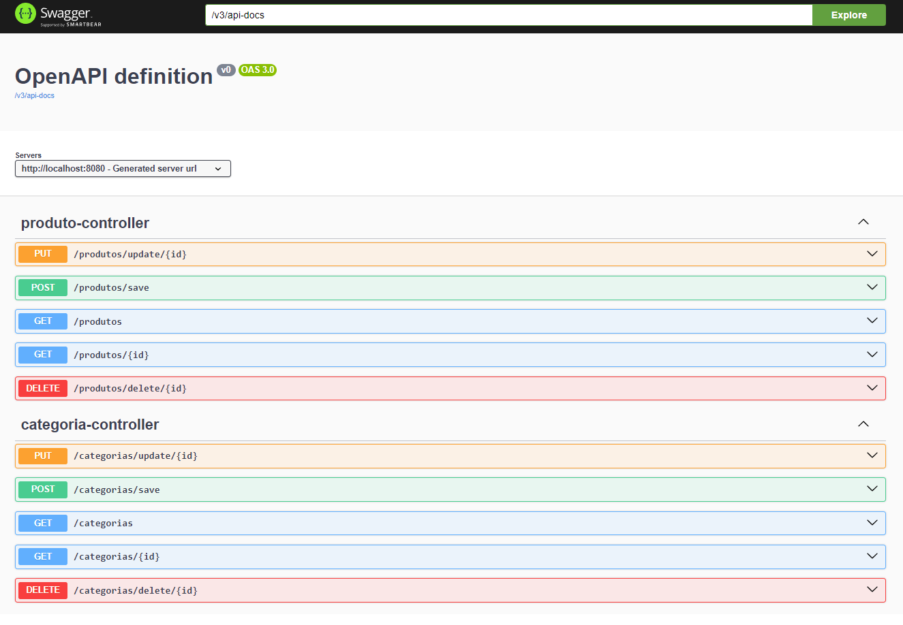

# API REST de Produtos e Categorias

Esta é uma API RESTful desenvolvida com Spring Boot versão 3.3.3, que permite realizar operações CRUD (Create, Read, Update, Delete) em entidades de Produtos e Categorias. 
Um Produto pode ter uma Categoria e uma Categoria pode conter vários Produtos.

## Tecnologias Utilizadas

- **Spring Boot 3.3.3**: Framework principal para construção da API.
- **JPA & Hibernate**: Para mapeamento objeto-relacional e persistência de dados.
- **Banco de Dados H2**: Utilizado para testes e desenvolvimento.
- **Swagger**: Para documentação interativa dos endpoints da API.

## Estrutura do Projeto

O projeto segue uma arquitetura tradicional em camadas:

- **Controller**: Responsável por receber as requisições HTTP e retornar as respostas.
- **Service**: Contém a lógica de negócios da aplicação.
- **Repository**: Camada de acesso a dados, utilizando Spring Data JPA.
- **Entidades**: Representam os objetos de domínio, mapeados para as tabelas do banco de dados.

## Endpoints Disponíveis 


### Produtos

- **GET /produtos**: Retorna todos os produtos.
  - **Resposta**: `200 OK`
  ```json
  [
    {
      "id": 1,
      "nome": "Produto 1",
      "preco": 100.00,
      "categoria": {
        "id": 1,
        "nome": "Categoria 1"
      }
    },
    {
      "id": 2,
      "nome": "Produto 2",
      "preco": 150.00,
      "categoria": {
        "id": 1,
        "nome": "Categoria 1"
      }
    }
  ]

- **GET /categorias**: Retorna todas as categorias.
  - **Resposta**: `200 OK`
  ```json
   [
  {
    "id": 1,
    "nome": "Categoria 1"
  },
  {
    "id": 2,
    "nome": "Categoria 2"
    }
  ]


## Banco de Dados H2
A aplicação utiliza o banco de dados em memória H2 para testes. Você pode acessar a interface web do H2 para inspecionar as tabelas e dados persistidos.

- URL de acesso: http://localhost:8080/h2-console
- JDBC URL: jdbc:h2:mem:testdb
- Username: sa
- Password: (deixe em branco)

## Documentação Swagger
A API está documentada utilizando Swagger, permitindo que você explore os endpoints e teste as requisições diretamente do navegador.

- URL de acesso: http://localhost:8080/api  


